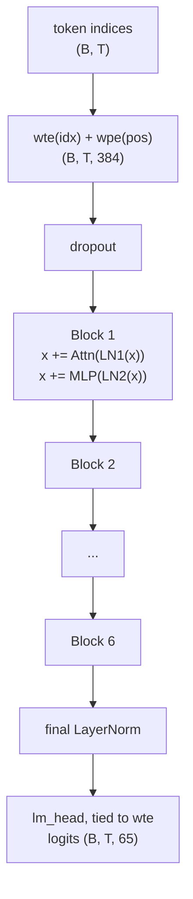

# gpt-from-scratch

A small GPT-style language model built entirely from scratch in PyTorch — no `transformers`, no `minGPT`, just tensors.

[](https://github.com/VictorMerk/gpt-from-scratch/actions/workflows/ci.yml)
[](https://github.com/VictorMerk/gpt-from-scratch)
[](LICENSE)
[](https://github.com/astral-sh/ruff)
[](https://docs.astral.sh/uv/)

## Why this repo

Most "build a GPT" projects stop at a toy loop around someone else's attention. Here every load-bearing piece is hand-implemented and tested: multi-head causal **attention** (via `F.scaled_dot_product_attention`), the causal **masking** logic (including the explicit-mask path for cached decoding), **weight tying** between input embeddings and the LM head, correct **AdamW weight-decay grouping**, a byte-level **BPE tokenizer** trained from scratch, a warmup + cosine **LR schedule**, and an incremental **KV cache** for fast generation. The whole thing is one readable Python package with six CLI entry points, full test coverage on CPU-only CI, and honest documentation.

## Features

**Model**

- Decoder-only transformer with pre-norm residual blocks and tied input/output embeddings by default (`model.py`)
- Causal self-attention through `F.scaled_dot_product_attention` (Flash Attention / memory-efficient path)
- Incremental decoding with a per-layer KV cache; cached and uncached generation verified equivalent
- Configurable architecture: RoPE or learned positions, LayerNorm or RMSNorm, GELU or SwiGLU MLP, tied or untied embeddings (`GPTConfig`)
- GPT-2 style initialization with residual-output projections scaled by `1/sqrt(2 * n_layer)`
- Model size presets (`nano` / `micro` / `small` / `medium`) plus fully configurable dimensions

**Tokenization**

- Character-level tokenizer and a from-scratch byte-pair-encoding tokenizer (`train` / `encode` / `decode` / `save` / `load`)

**Training**

- Warmup + cosine decay LR schedule
- Gradient accumulation, global-norm gradient clipping, bf16/fp16 mixed precision
- Resumable training with best-checkpoint tracking and JSONL loss logging (tokens/sec, ETA)
- Optional EMA of weights, used for validation and saved inside checkpoints (`--ema`)
- Checkpoint rotation keeping the k best checkpoints by validation loss (`--save-top-k`)
- Fully deterministic mode (`--deterministic`) and an overfit-N-fixed-batches diagnostic (`--overfit-batches`)

**Inference**

- Sampling with temperature, top-k, top-p (nucleus), and min-p
- Streaming token-by-token output and repeatable stop sequences
- Batch generation from a prompts file
- Interactive REPL with live `/temp`, `/top-k`, `/top-p`, `/min-p` controls

**Evaluation and analysis**

- Evaluation CLI: held-out perplexity and bits-per-character
- Benchmark CLI: cached vs uncached generation throughput
- Loss-curve plotting from JSONL training logs (`gpt-from-scratch-plot`, optional matplotlib extra)
- Sampling sweep over temperature x top-k x top-p reporting NLL and distinct-1/distinct-2 diversity (`gpt-from-scratch-sweep`)

**Runtime**

- Auto device selection (CUDA / MPS / CPU) with pinned-memory async transfers on CUDA

## Architecture



Each block is pre-norm attention (fused QKV projection, head split, SDPA causal attention, output projection, residual add) followed by pre-norm MLP (4x expansion, GELU, projection, residual add). See [ARCHITECTURE.md](ARCHITECTURE.md) for the full tensor-shape walkthrough of a forward pass and the parameter-count breakdown (~10.77 M for the default config).

## Quickstart

Requires Python 3.12+ and [uv](https://docs.astral.sh/uv/).

```bash
# install dependencies into a local .venv (dev tools included)
uv sync --dev

# train the default model (6 layers, 384 dim, 5000 iterations)
uv run gpt-from-scratch-train --max-iters 5000 --dtype bfloat16 --device cuda

# sample from the trained checkpoint
uv run gpt-from-scratch-sample --prompt "ROMEO:" --max-new-tokens 500 --top-p 0.9

# measure held-out perplexity and bits-per-character
uv run gpt-from-scratch-evaluate --checkpoint checkpoints/checkpoint.pt

# benchmark cached vs uncached generation throughput
uv run gpt-from-scratch-benchmark
```

Without `--device`, training picks CUDA, then MPS, then CPU automatically. On CPU-only machines use smaller dimensions:

```bash
uv run gpt-from-scratch-train --n-layer 4 --n-head 4 --n-embd 256 --batch-size 32 --block-size 128 --max-iters 2000
```

## CLI reference

All six entry points are installed as console scripts by `pip install .` / `uv sync`.

| Command | Purpose | Key flags |
| --- | --- | --- |
| `gpt-from-scratch-train` | Train on tiny Shakespeare | `--data-dir` (data), `--out-dir` (checkpoints), `--device`, `--max-iters` (5000), `--batch-size` (64), `--block-size` (256), `--n-layer/--n-head/--n-embd` (6/6/384), `--dropout` (0.1), `--lr` (1e-3), `--lr-warmup-iters` (100), `--lr-min-ratio` (0.1), `--weight-decay` (0.1), `--grad-accum` (1), `--grad-clip` (1.0), `--dtype float32\|bfloat16\|float16`, `--eval-interval` (250), `--eval-iters` (50), `--resume PATH`, `--log-file PATH`, `--seed` (1337), `--ema` with `--ema-decay` (0.999), `--save-top-k INT` (0 = off), `--deterministic`, `--overfit-batches INT` (0 = off) |
| `gpt-from-scratch-sample` | Generate text from a checkpoint | `--checkpoint` (checkpoints/checkpoint.pt), `--prompt` ("\n"), `--max-new-tokens` (500), `--temperature` (0.8), `--top-k`, `--top-p`, `--min-p`, `--seed` (1337), `--stream`, `--stop STR` (repeatable), `--prompts-file PATH` (one prompt per line; blank lines and `#` comments skipped), `--interactive` (REPL with `/temp X`, `/top-k X`, `/top-p X`, `/min-p X`, `/quit`) |
| `gpt-from-scratch-evaluate` | Perplexity + bits/char on validation data | `--checkpoint` (required), `--data-dir` (data), `--max-batches` (50), `--batch-size` (64), `--device` |
| `gpt-from-scratch-benchmark` | Cached vs uncached tokens/sec | `--checkpoint` (optional; random tiny model if omitted), `--batch-size` (8), `--max-new-tokens` (100), `--device` |
| `gpt-from-scratch-plot` | Plot train/val loss curves from a JSONL log | `--log-file` (required), `--out` (losses.png). Requires the optional plot extra: `uv sync --extra plot` |
| `gpt-from-scratch-sweep` | Grid-search sampling parameters over a checkpoint | `--checkpoint` (required), `--temps` (0.5,0.8,1.0), `--top-ks` (0,50,200; 0 disables top-k), `--top-ps` (0.0,0.9; 0 disables top-p), `--samples-per-combo` (2), `--max-new-tokens` (64), `--prompt` ("\n"), `--seed` (1337), `--device`. Prints a table of NLL and distinct-1/distinct-2 sorted by NLL |

Model size presets are importable from Python:

```python
from gpt_from_scratch.model import GPT_PRESETS  # nano / micro / small / medium GPTConfigs
```

### Configuration options

Four switches on `GPTConfig` change the architecture; all default to the classic GPT-2 recipe:

| Option | Choices | Default | Effect |
| --- | --- | --- | --- |
| `pos_encoding` | `"learned"` / `"rope"` | `"learned"` | learned position table vs rotary embeddings (no position parameters) |
| `norm_type` | `"layernorm"` / `"rmsnorm"` | `"layernorm"` | LayerNorm vs RMSNorm in every block and the final norm |
| `mlp_type` | `"gelu"` / `"swiglu"` | `"gelu"` | 4x-expansion GELU MLP vs LLaMA-style gated SwiGLU (hidden = 8/3 * n_embd rounded up to a multiple of 8, bias-free) |
| `tie_embeddings` | `True` / `False` | `True` | share weights between input embeddings and the LM head |

Sampling adds one more knob: `generate(min_p=...)`, exposed as `--min-p` on the generation CLI (default off). Tokens whose probability falls below `min_p * max_prob` are dropped before renormalizing; see [MATH.md](MATH.md) for all of these formulas.

## Train on Google Colab (free GPU)

Open the ready-made notebook directly:

[](https://colab.research.google.com/github/VictorMerk/gpt-from-scratch/blob/main/notebooks/gpt_from_scratch_colab.ipynb)

Or do it manually in any Colab notebook with *Runtime > Change runtime type > T4 GPU* selected:

```python
!git clone https://github.com/VictorMerk/gpt-from-scratch.git
%cd gpt-from-scratch
!pip install -e . -q
```

then run `!gpt-from-scratch-train --device cuda --dtype bfloat16` to start training.

## Project layout

```text
gpt-from-scratch/
├── src/gpt_from_scratch/
│   ├── model.py        # GPT, GPTConfig, presets, KV cache, sampling, AdamW grouping
│   ├── bpe.py          # BPETokenizer: train / encode / decode / save / load
│   ├── tokenizer.py    # CharTokenizer
│   ├── data.py         # tiny Shakespeare download, train/val split
│   ├── schedule.py     # warmup + cosine decay LR schedule
│   ├── train.py        # training-loop CLI
│   ├── sample.py       # generation CLI
│   ├── evaluate.py     # perplexity / bits-per-character CLI
│   ├── benchmark.py    # cached vs uncached throughput CLI
│   ├── plots.py        # loss curves from JSONL training logs (gpt-from-scratch-plot)
│   └── sweep.py        # temperature x top-k x top-p grid sweep (gpt-from-scratch-sweep)
├── tests/              # pytest suite mirroring the source modules
├── notebooks/
│   └── gpt_from_scratch_colab.ipynb   # one-click Colab training
├── .github/workflows/ci.yml          # lint + tests on Python 3.12 / 3.13 with coverage
├── Makefile             # common dev commands (test, lint, train-small, plot, sweep, clean)
├── Dockerfile           # CPU-only torch image; training CLI as entrypoint
└── pyproject.toml
```

## Development

```bash
uv sync --dev                 # install with dev dependencies
uv run pytest -q              # run tests
uv run ruff check .           # lint
uv run ruff format .          # format
uvx pre-commit install        # run ruff hooks on every commit
```

A [Makefile](Makefile) wraps the common workflow: `make help`, `make sync`, `make test`, `make coverage`, `make lint`, `make format`, plus `make train-small` (tiny CPU smoke run), `make sample`, `make bench`, `make plot`, `make sweep`, and `make clean` — variables are overridable, e.g. `make sweep CHECKPOINT=checkpoints/best.pt`.

A [Dockerfile](Dockerfile) builds a reproducible CPU-only training image:

```bash
docker build -t gpt-from-scratch .
docker run --rm -v "$PWD/checkpoints:/app/checkpoints" gpt-from-scratch --max-iters 100
```

Dependabot keeps pip dependencies and GitHub Actions up to date with weekly checks.

CI runs ruff and the full test suite with coverage reporting on Python 3.12 and 3.13 for every push and pull request. See [CONTRIBUTING.md](CONTRIBUTING.md) for conventions and how to pick up a roadmap item.

## Roadmap

100 planned improvements are tracked in [ROADMAP.md](ROADMAP.md); checked items have shipped.

## Results

We deliberately do not publish our own measured loss or throughput numbers here until each figure can be reproduced from a committed command and seed. As an **external reference point only**: nanoGPT reports a validation loss of about **1.48** for its ~10.7 M-parameter character-level model on `shakespeare_char` after ~5000 iterations — a configuration comparable in size and budget to this repo's default. That number comes from Karpathy's nanoGPT project, not from this repository.

## FAQ

**Why is the tokenizer character-level by default?**
A character vocabulary (~65 entries for Shakespeare) is small enough to print in full, keeps every intermediate tensor easy to reason about, and matches the shakespeare-char setup used across the literature, so results stay comparable. It also removes tokenization as a confounder while you study the model itself. When you want subword units, the repo ships a from-scratch BPE trainer (`bpe.py`) with the same interface.

**Why pre-norm instead of post-norm?**
Normalizing *before* each sub-layer (`x + Attn(LN(x))`) keeps the residual stream's scale under control, so gradients flow through many blocks without extra warmup tricks or careful scaling. That stability at depth is why essentially every modern LLM (GPT-2 onward) uses it. Post-norm can match it at this depth but needs more tuning as models grow.

**Why tied embeddings?**
Tying the input embedding matrix to the LM head removes a full `vocab_size x n_embd` parameter block — roughly half of all embedding parameters, which matters for a ~10 M model — and acts as a regularizer on small datasets because the same weights must serve both roles. GPT-2 ties by default; set `tie_embeddings=False` to ablate.

**Why does AdamW weight decay skip biases and norm parameters?**
Weight decay pulls weights toward zero as a regularizer; that prior makes sense for matrices but not for biases or LayerNorm/RMSNorm gains, which are better left free (decaying them just limits their useful range). `configure_optimizers` therefore puts `dim >= 2` tensors in a decayed group and everything else in a zero-decay group. The decay itself is *decoupled*: applied directly to theta in the update rather than added as L2 to the gradient, where the adaptive denominator would rescale it per-parameter. See [MATH.md](MATH.md).

**When should I pick RoPE over learned positions?**
RoPE injects position by rotating query/key pairs, so it has no learned position parameters and extrapolates more gracefully to sequences longer than the training context. Choose `pos_encoding="rope"` when you care about length generalization or want to drop the `wpe` table. At one fixed context length on one fixed dataset, learned positions perform comparably — both options are one config flag away.

## Comparison

How this repo relates to the two projects it is most often measured against, described generically:

| | gpt-from-scratch | nanoGPT | minGPT |
| --- | --- | --- | --- |
| Focus | educational completeness: every load-bearing piece hand-implemented and tested | compact research harness aimed at real training runs | minimal teaching artifact accompanying a video lecture |
| Tokenizer | character-level plus a byte-level BPE trained from scratch | char-level demos; delegates subword encoding to external tokenizers (e.g. tiktoken) | char-level demos; no BPE implementation |
| KV cache | incremental cached decoding, verified equivalent to full recompute | no | no |
| LR schedule | warmup + cosine decay, implemented from scratch | warmup + cosine | warmup + cosine |
| Mixed precision | bf16 autocast; fp16 with GradScaler | bf16/fp16 autocast | fp16 autocast via GradScaler |
| Eval / analysis CLIs | evaluate (ppl/bpc), benchmark, plot, sweep | val loss inside the training loop plus a sampling script | notebook-driven; no dedicated eval CLIs |
| Architecture switches | RoPE / RMSNorm / SwiGLU / tying toggles behind one config | fixed GPT-2-style layout | fixed GPT-2-style layout |
| License | MIT | MIT | Apache-2.0 |
