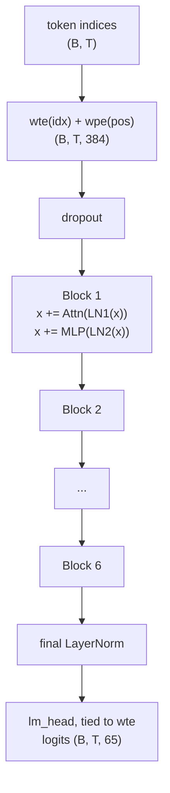

# gpt-from-scratch

A small GPT-style language model built entirely from scratch in PyTorch — no `transformers`, no `minGPT`, just tensors.

[](https://github.com/VictorMerk/gpt-from-scratch/actions/workflows/ci.yml)
[](https://github.com/VictorMerk/gpt-from-scratch)
[](LICENSE)
[](https://github.com/astral-sh/ruff)
[](https://docs.astral.sh/uv/)

## Why this repo

Most "build a GPT" projects stop at a toy loop around someone else's attention. Here every load-bearing piece is hand-implemented and tested: multi-head causal **attention** (via `F.scaled_dot_product_attention`), the causal **masking** logic (including the explicit-mask path for cached decoding), **weight tying** between input embeddings and the LM head, correct **AdamW weight-decay grouping**, a byte-level **BPE tokenizer** trained from scratch, a warmup + cosine **LR schedule**, and an incremental **KV cache** for fast generation. The whole thing is one readable Python package with four CLI entry points, full test coverage on CPU-only CI, and honest documentation.

## Features

- Decoder-only transformer with pre-norm residual blocks and tied input/output embeddings (`model.py`)
- Causal self-attention through `F.scaled_dot_product_attention` (Flash Attention / memory-efficient path)
- Incremental decoding with a per-layer KV cache; cached and uncached generation verified equivalent
- Sampling with temperature, top-k, and top-p (nucleus)
- GPT-2 style initialization with residual-output projections scaled by `1/sqrt(2 * n_layer)`
- Model size presets (`nano` / `micro` / `small` / `medium`) plus fully configurable dimensions
- Character-level tokenizer and a from-scratch byte-pair-encoding tokenizer (`train` / `encode` / `decode` / `save` / `load`)
- Warmup + cosine decay LR schedule
- Gradient accumulation, global-norm gradient clipping, bf16/fp16 mixed precision
- Resumable training with best-checkpoint tracking and JSONL loss logging (tokens/sec, ETA)
- Evaluation CLI: held-out perplexity and bits-per-character
- Benchmark CLI: cached vs uncached generation throughput
- Auto device selection (CUDA / MPS / CPU) with pinned-memory async transfers on CUDA

## Architecture



Each block is pre-norm attention (fused QKV projection, head split, SDPA causal attention, output projection, residual add) followed by pre-norm MLP (4x expansion, GELU, projection, residual add). See [ARCHITECTURE.md](ARCHITECTURE.md) for the full tensor-shape walkthrough of a forward pass and the parameter-count breakdown (~10.77 M for the default config).

## Quickstart

Requires Python 3.12+ and [uv](https://docs.astral.sh/uv/).

```bash
# install dependencies into a local .venv (dev tools included)
uv sync --dev

# train the default model (6 layers, 384 dim, 5000 iterations)
uv run gpt-from-scratch-train --max-iters 5000 --dtype bfloat16 --device cuda

# sample from the trained checkpoint
uv run gpt-from-scratch-sample --prompt "ROMEO:" --max-new-tokens 500 --top-p 0.9

# measure held-out perplexity and bits-per-character
uv run gpt-from-scratch-evaluate --checkpoint checkpoints/checkpoint.pt

# benchmark cached vs uncached generation throughput
uv run gpt-from-scratch-benchmark
```

Without `--device`, training picks CUDA, then MPS, then CPU automatically. On CPU-only machines use smaller dimensions:

```bash
uv run gpt-from-scratch-train --n-layer 4 --n-head 4 --n-embd 256 --batch-size 32 --block-size 128 --max-iters 2000
```

## CLI reference

All four entry points are installed as console scripts by `pip install .` / `uv sync`.

| Command | Purpose | Key flags |
| --- | --- | --- |
| `gpt-from-scratch-train` | Train on tiny Shakespeare | `--data-dir` (data), `--out-dir` (checkpoints), `--device`, `--max-iters` (5000), `--batch-size` (64), `--block-size` (256), `--n-layer/--n-head/--n-embd` (6/6/384), `--dropout` (0.1), `--lr` (1e-3), `--lr-warmup-iters` (100), `--lr-min-ratio` (0.1), `--weight-decay` (0.1), `--grad-accum` (1), `--grad-clip` (1.0), `--dtype float32\|bfloat16\|float16`, `--eval-interval` (250), `--eval-iters` (50), `--resume PATH`, `--log-file PATH`, `--seed` (1337) |
| `gpt-from-scratch-sample` | Generate text from a checkpoint | `--checkpoint` (checkpoints/checkpoint.pt), `--prompt` ("\n"), `--max-new-tokens` (500), `--temperature` (0.8), `--top-k`, `--top-p`, `--seed` (1337) |
| `gpt-from-scratch-evaluate` | Perplexity + bits/char on validation data | `--checkpoint` (required), `--data-dir` (data), `--max-batches` (50), `--batch-size` (64), `--device` |
| `gpt-from-scratch-benchmark` | Cached vs uncached tokens/sec | `--checkpoint` (optional; random tiny model if omitted), `--batch-size` (8), `--max-new-tokens` (100), `--device` |

Model size presets are importable from Python:

```python
from gpt_from_scratch.model import GPT_PRESETS  # nano / micro / small / medium GPTConfigs
```

## Train on Google Colab (free GPU)

Open the ready-made notebook directly:

[](https://colab.research.google.com/github/VictorMerk/gpt-from-scratch/blob/main/notebooks/gpt_from_scratch_colab.ipynb)

Or do it manually in any Colab notebook with *Runtime > Change runtime type > T4 GPU* selected:

```python
!git clone https://github.com/VictorMerk/gpt-from-scratch.git
%cd gpt-from-scratch
!pip install -e . -q
```

then run `!gpt-from-scratch-train --device cuda --dtype bfloat16` to start training.

## Project layout

```text
gpt-from-scratch/
├── src/gpt_from_scratch/
│   ├── model.py        # GPT, GPTConfig, presets, KV cache, sampling, AdamW grouping
│   ├── bpe.py          # BPETokenizer: train / encode / decode / save / load
│   ├── tokenizer.py    # CharTokenizer
│   ├── data.py         # tiny Shakespeare download, train/val split
│   ├── schedule.py     # warmup + cosine decay LR schedule
│   ├── train.py        # training-loop CLI
│   ├── sample.py       # generation CLI
│   ├── evaluate.py     # perplexity / bits-per-character CLI
│   └── benchmark.py    # cached vs uncached throughput CLI
├── tests/              # pytest suite mirroring the source modules
├── notebooks/
│   └── gpt_from_scratch_colab.ipynb   # one-click Colab training
├── .github/workflows/ci.yml          # lint + tests on Python 3.12 / 3.13 with coverage
└── pyproject.toml
```

## Development

```bash
uv sync --dev                 # install with dev dependencies
uv run pytest -q              # run tests
uv run ruff check .           # lint
uv run ruff format .          # format
uvx pre-commit install        # run ruff hooks on every commit
```

CI runs ruff and the full test suite with coverage reporting on Python 3.12 and 3.13 for every push and pull request. See [CONTRIBUTING.md](CONTRIBUTING.md) for conventions and how to pick up a roadmap item.

## Roadmap

100 planned improvements are tracked in [ROADMAP.md](ROADMAP.md); checked items have shipped.

## Results

We deliberately do not publish our own measured loss or throughput numbers here until each figure can be reproduced from a committed command and seed. As an **external reference point only**: nanoGPT reports a validation loss of about **1.48** for its ~10.7 M-parameter character-level model on `shakespeare_char` after ~5000 iterations — a configuration comparable in size and budget to this repo's default. That number comes from Karpathy's nanoGPT project, not from this repository.
